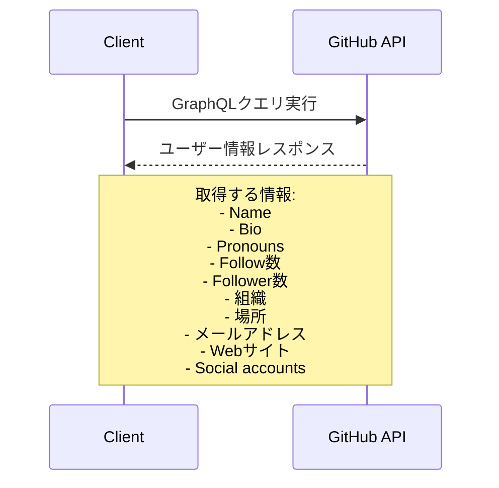
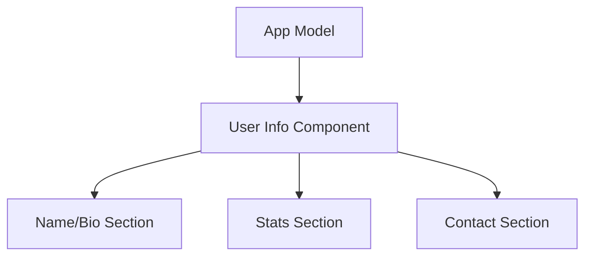
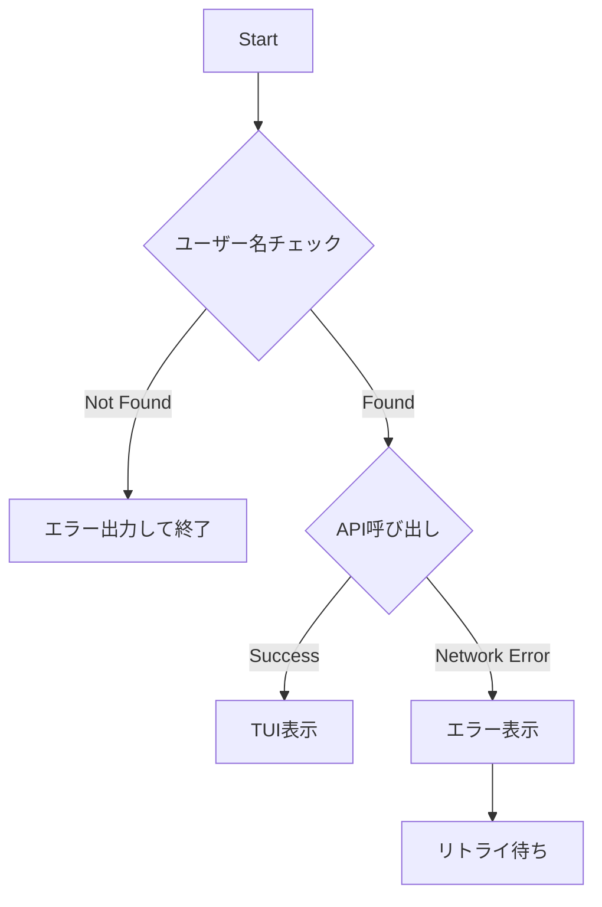

# gh-portrait 実装計画

## 概要

gh-portraitは、GitHubユーザーの様々な情報を閲覧するためのgh拡張フルスクリーンTUIツールです。

## 実装フェーズ

実装は以下の順序で進めていきます：

1. ユーザー基本情報の表示
2. タブ切り替え機能 + Pinnedリポジトリリスト表示
3. 最もstarを集めているユーザーのリポジトリ30件表示
4. ユーザーが貢献したうち最もstarを集めているリポジトリ30件表示
5. リポジトリ選択・ブラウザオープン機能

## フェーズ1：ユーザー基本情報の表示

### プロジェクト構造

```
gh-portrait/
├── cmd/
│   └── root.go          # コマンドライン引数の処理
├── internal/
│   ├── github/
│   │   ├── client.go    # GitHub APIクライアント
│   │   └── user.go      # ユーザー情報の型定義とAPI呼び出し
│   └── ui/
│       ├── app.go       # メインのbubbletea Model
│       └── components/
│           └── user_info.go  # ユーザー情報表示コンポーネント
└── main.go              # エントリーポイント
```

### 主要コンポーネント

#### GitHub API層

- gh.DefaultGraphQLClientを使用してGraphQLクライアントを初期化
- 以下のユーザー情報を一度のクエリで取得：
  - Name
  - Bio
  - Pronouns
  - Follow数
  - Follower数
  - 組織
  - 場所
  - メールアドレス
  - Webサイト
  - Social accounts



#### TUI層

- bubbletea/bubblesを使用したコンポーネントベースの設計
- ユーザー情報を見やすくレイアウト
- エラー状態の表示とリトライ機能の実装



### エラーハンドリング

- TUI起動前のエラー（ユーザーが存在しない場合など）
  - ターミナルに直接エラーメッセージを出力
  - プログラムを終了

- TUI起動後のエラー（ネットワークエラーなど）
  - TUI内にエラーメッセージを表示
  - リトライ機能を提供



### 使用するライブラリ

- github.com/charmbracelet/bubbles
- github.com/charmbracelet/bubbletea
- github.com/cli/go-gh/v2
- github.com/cli/shurcooL-graphql

### 開発手順

1. GitHub API層の実装
   - GraphQLクライアントの初期化
   - ユーザー情報取得クエリの実装
   - レスポンス型の定義

2. TUI層の実装
   - メインのApp Modelの実装
   - ユーザー情報表示コンポーネントの実装
   - エラー表示コンポーネントの実装

3. エラーハンドリングの実装
   - コマンドライン引数のバリデーション
   - エラー状態の管理と表示
   - リトライ機能の実装

4. 結合テスト
   - 各コンポーネントの結合
   - エラーケースの検証
   - UI/UXの確認