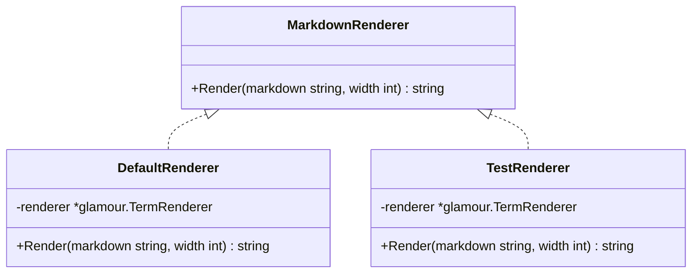

# Markdown Renderer Design

## Overview

To handle different rendering styles between production and test environments, we'll introduce a MarkdownRenderer interface and its implementations.



## Components

### MarkdownRenderer Interface
```go
type MarkdownRenderer interface {
    Render(markdown string, width int) string
}
```

### DefaultRenderer
- Uses standard style for production
- Provides styled output with proper formatting

### TestRenderer
- Uses "notty" style for testing
- Provides plain output without ANSI escape sequences

## Implementation Plan

1. Create MarkdownRenderer interface
2. Implement DefaultRenderer with standard styling
3. Implement TestRenderer with notty styling
4. Modify UserInfo to use MarkdownRenderer
5. Update tests to use TestRenderer