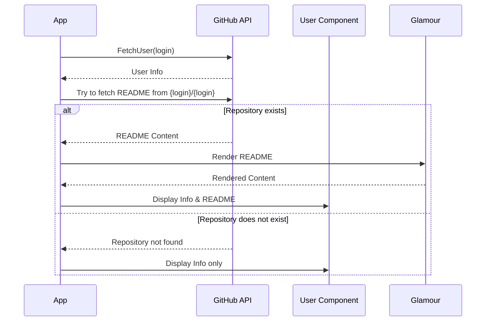

# README Error Handling Plan

## Current Issue
When a user doesn't have a repository named `{user}/{user}`, the GraphQL query fails with:
`Error: GraphQL: Could not resolve to a Repository with the name '{user}/{user}'. (user.repository)`

## Solution Design



## Implementation Plan

1. GraphQL Query Modification
```graphql
query {
  user(login: $login) {
    # existing fields...
    repository(name: $login) {
      object(expression: "HEAD:README.md") {
        ... on Blob {
          text
        }
      }
    }
  }
}
```

2. Error Handling
- Treat missing repository as a case where README is nil
- Do not display error messages for missing repository
- Continue to display user information without README section